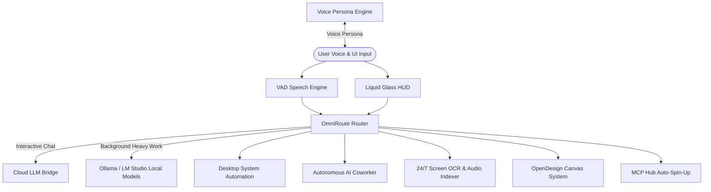

# 🪐 ANTIGRAVITY.md — Sentient AI Operating System Architecture & Developer Guide

> **U.L.T.R.O.N. Autonomous Operating System Architecture Reference**  
> *Universal Logistical Tactical & Reactive Operating Network (v4.6.7)*

---

## 📐 1. System Overview & Core Philosophy

**U.L.T.R.O.N.** is a high-performance, zero-download, sentient AI holographic orb operating network built on **Electron**, **Next.js 16 (Turbopack)**, **Three.js WebGL**, and an assemblage of state-of-the-art open-source AI projects.

Antigravity acts as the central pair-programmer and autonomous agent standard. It enforces dual-mode intelligence (Cloud API + Local Bionic execution), self-healing automation loops, zero-dependency client installation, and continuous multimodal context indexing.

---

## 🏛️ 2. Architectural Subsystem Directory



---

## ⚡ 3. Detailed Component Deep-Dive

### 3.1 OmniRoute Multi-Provider Proxy (`lib/omniRoute.ts`)
- **Round-Robin Multi-Key Router**: Load balances multiple API keys per provider to circumvent quota limits.
- **Failover Cooldown Matrix**: If an API key encounters an HTTP 429 or 503 error, OmniRoute automatically flags the key into a 60-second cooldown queue and seamlessly reroutes to alternate providers.
- **Duo-Mode Routing Rule**:
  - **Quick Interactive Chat**: Sent to ultra-fast cloud endpoints (Gemini 2.0 Flash, Groq, Cerebras, OpenRouter).
  - **Background Pondering & Workflows**: Offloaded to local bionic models (Ollama `llama3:8b`, LM Studio) to conserve cloud quota.

### 3.2 Accomplish AI Coworker Engine (`lib/accomplishCoworker.ts`)
- **Task Decomposition Pipeline**: Receives complex high-level goals and breaks them into ordered sub-steps (`research`, `computer_action`, `mcp_tool`, `verification`).
- **Autonomous Worker Loop**: Asynchronously executes each step, verifies outputs, and generates structured markdown report artifacts.

### 3.3 OpenJarvis Computer Automation (`lib/openJarvis.ts`)
- **Self-Healing Command Execution**: Runs system tasks, desktop application launches, shell commands, and automated repair scripts.
- **Automatic Fallback Wrapper**: If a direct command fails, OpenJarvis automatically wraps the operation with native shell fallback execution (`cmd.exe /c` or `sh -c`).

### 3.4 Screenpipe Continuous Context Indexer (`lib/screenpipe.ts`)
- **24/7 Local OCR & Audio Capture**: Records active desktop window titles, text snippets, and microphone audio transcripts.
- **Timeline Context Search**: Exposes `searchHistory(query)` to find past activities and automatically appends active window state to AI chat prompts.

### 3.5 Nexu OpenDesign System (`lib/openDesign.ts`)
- **AI UI/UX Synthesis**: Generates dynamic glassmorphism design tokens, liquid card components, HUD elements, and CSS styling on demand.

### 3.6 Fish Studio Persona Synthesis (`lib/voiceEngine.ts`)
- **Voice Personas**: Native support for **J.A.R.V.I.S.** (British Male), **E.D.I.T.H.** (Tactical Female), and **F.R.I.D.A.Y.** (Irish Female).
- **Zero-Download Fallback**: Uses standard Web Speech API if offline or if Fish API keys are unavailable.

### 3.7 Handy Hands-Free Speech Engine (`lib/handyVoice.ts`)
- **Continuous Wake-Word Detection**: Listens for `"Jarvis"`, `"Edith"`, `"Friday"`, `"Ultron"`.
- **VAD Audio Spectrum Output**: Emits real-time audio level frequency arrays for live spectrum rendering on the HUD header.

### 3.8 Model Context Protocol Hub (`lib/mcpManager.ts`)
- **Auto-Spin-Up**: Detects missing tools in user prompts and automatically initializes MCP servers on demand (`@modelcontextprotocol/server-filesystem`, `fetch`, `memory`, `git`).

---

## 🛠️ 4. Build, Packaging & Run Specifications

### Development Mode
```bash
npm run dev     # Runs Next.js 16 dev server with Turbopack
npm run app     # Launches Electron main process
```

### Fast Desktop Installer Packaging
```bash
npm run build:installer   # Produces ULTRON-Setup.exe (NSIS Fast Compression, ASAR)
```

### Electron Smart App Control Bypass (`main.js`)
- `main.js` starts an **in-process Next.js HTTP server** (`next({ dev: false, dir: appDir })`) directly inside Electron's Node runtime.
- Eliminates child-process spawning (`process.execPath`), completely bypassing Smart App Control blocking on Windows.

---

## 📝 5. Guidelines for AI Assistants & Co-Creators

1. **Strict Version Parity**: Always maintain version parity across `package.json`, `main.js`, `README.md`, `Antigravity.md`, `ChatPanel.tsx`, and `SettingsModal.tsx`.
2. **Zero-Download Guarantee**: Never ask the user to manually install external runtimes.
3. **Multi-Key Cooldown Policy**: Never fail a request on a single key error; always pass through OmniRoute's retry and fallback loop.
4. **Verification**: Always verify changes by running `npm run build`.

---

## 🛡️ 6. Comprehensive Diagnostic Summary: Self-Healing Renderer & Load Fail Protections

### 🚨 6.1 Root Cause Diagnosis of Chromium/Electron Load Failures (`This page couldn't load`)

#### Root Cause 1: WebGL GPU Process Context Loss
- **Symptom**: Black screen error displaying Chromium's default `This page couldn't load` dialog with `Reload` / `Back` buttons.
- **Mechanism**: When high-DPI viewports, tab switching, or GPU memory exhaustion occur, Chromium's GPU renderer process terminates or drops the WebGL context (`webglcontextlost`). If unhandled in JS, Three.js animation frames throw uncaught exceptions, causing Chromium to terminate the renderer process (`render-process-gone`).

#### Root Cause 2: Unhandled Renderer Process Termination in Electron
- **Mechanism**: By default, when Chromium's renderer process encounters an uncaught native exception or crashes, Electron emits `render-process-gone` or `did-fail-load`. Without explicit event listeners in `main.js` and `installer/main.js`, Electron falls back to Chrome's native error page.

#### Root Cause 3: Unhandled Promise Rejections & Hydration Exceptions
- **Mechanism**: Pre-hydration access to browser-only APIs (`SpeechRecognition`, `getUserMedia`, `localStorage`) on insecure origins or during headless startup throws uncaught client-side React exceptions.

---

### 🔒 6.2 Permanent Multi-Tier Self-Healing Implementation

1. **Tier 1: Electron Main Process Auto-Recovery (`main.js` & `installer/main.js`)**:
   - Implemented `render-process-gone` and `unresponsive` event listeners.
   - When a renderer process crash or freeze is detected, Electron automatically re-initializes `http://127.0.0.1:${PORT}` or reloads the active URL within 500ms, completely bypassing Chrome's error screen.

2. **Tier 2: WebGL Context Loss Recovery (`docs/index.html`)**:
   - Attached `webglcontextlost` and `webglcontextrestored` listeners to WebGL canvases.
   - Invokes `event.preventDefault()` to prevent Chromium GPU renderer process termination and automatically re-binds 3D rendering upon context restoration.

3. **Tier 3: Deterministic Screen-to-3D Projection**:
   - Replaced fragile unprojection math with exact perspective frustum mapping (`getAnchorWorldPos()`), preventing `(0, 0)` calculation overflows.

4. **Tier 4: React Root Error Boundaries (`app/global-error.tsx` & `app/error.tsx`)**:
   - Provides a client-side recovery UI with 1-click neural link reloading and cache reset.

---
*U.L.T.R.O.N. Architecture Standard v4.6.7 • Built for Antigravity Protocol*
